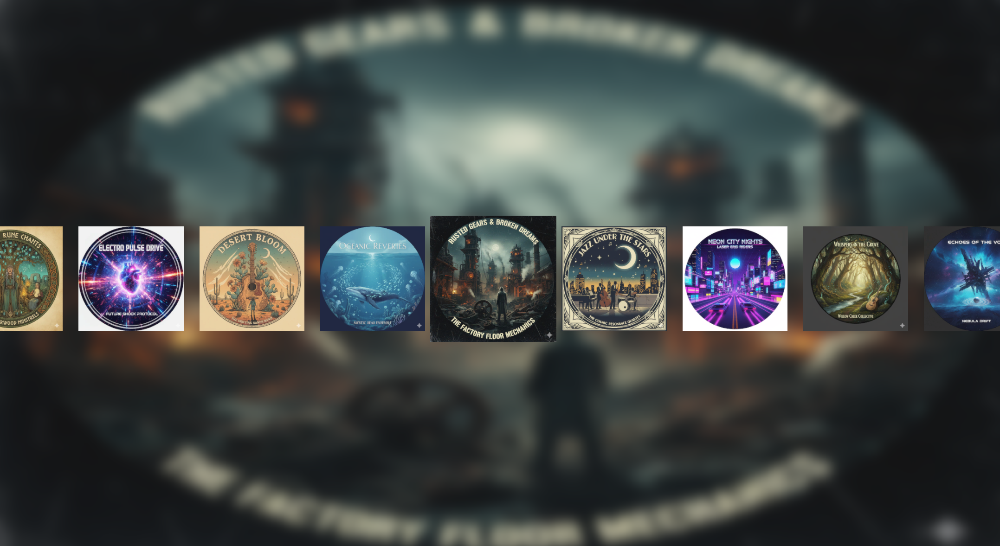

<h1 align="center">Dualsense Unreal Plugin</h1>

Integrate all the features of Sony's DualSense™ and DualShock 4® controllers into your Unreal Engine project.
 
 
<a href="https://github.com/rafaelvaloto/WindowsDualsenseUnreal/issues">Report Bug</a>
·
<a href="https://github.com/rafaelvaloto/WindowsDualsenseUnreal/issues">Suggest a Feature
</a>
·
<a href="https://github.com/rafaelvaloto/WindowsDualsenseUnreal/wiki">Documentation
</a>

 

> [!IMPORTANT]
> **v2.0.0-pre-release is now available!** We are testing major architecture improvements. Check it out in the [Releases](https://github.com/rafaelvaloto/Unreal-Dualsense/releases) section and help us with feedback.
>
> 🔄 **Upgrading from v1.x?** Please read our [**Migration Guide**](https://github.com/rafaelvaloto/Unreal-Dualsense/wiki/Migration-Guide:-Unreal%E2%80%90Dualsense-v1.x-to-v2.0).
>  
> 🎮 **New Example:** Check the updated **[Arena Shooter v2 Sample](https://drive.google.com/file/d/11iUQuWwA4zkFI_eP0roYbTDh0ss8614m/view?usp=drive_link)** to see the new implementation in action.
> 🎮 **New Example:** Check the updated **[Audio Haptics (USB & Wireless) v2 Sample](https://drive.google.com/file/d/1lGUBfz42gnh2bSIJTptC_LqOdFHsPuSi/view?usp=sharing)**
>
> 🎬 **Gyroscope Demo:** Watch the new aiming mechanics in action on **[YouTube](https://youtu.be/r_NhoODeELU?si=IdqRFx8_aimeIToD)**.
> 
> ⚠️ **Version 2.0.0 has the controller's touchpad feature disabled because it wasn't working correctly.**

## 📖 About the Project

Built with a cross-platform architecture, this Unreal Engine plugin provides a unified solution for integrating DualSense™ (PlayStation 5) and DualShock 4® (PlayStation 4) controllers. It delivers native support on PC while being architected for easy compilation across other Unreal Engine platforms, including PlayStation®. This asset provides direct API access to the complete feature set of each controller, including the revolutionary Haptic Feedback and Adaptive Triggers of the DualSense™. All features are exposed through a clean and well-documented function library for both Blueprint and C++.

Designed to bridge the gap left by generic controller support, this asset empowers developers to implement the high-fidelity, immersive feedback that makes Sony's controllers unique.

## ✨ Features
* 🏗️ **Extensible Multi-Platform Architecture**: Its flexible design enables compilation across all Unreal Engine platforms. Supporting new hardware is as simple as implementing the connection interface.
* 🔌 **Dynamic Connection (Hot-Swap)**: Automatically detects controller connection and disconnection, even during gameplay.
* ⚡ **Optimized for Multiplayer**: High-performance architecture with minimal impact on network games.
* 🎮 **Seamless Input Integration**: Coexists perfectly with Unreal Engine's native input managers (like Enhanced Input) and other gamepad plugins, preventing conflicts between devices.
* 🎧 **Audio Haptics (USB & Wireless)**: Haptic feedback based on in-game audio.
* 🎯 **Adaptive Triggers**: Full control over resistance, effect, and vibration on R2/L2 triggers.
* 💡 **Lightbar Control**: Dynamically change the controller's LED color.
* 🎤 **Microphone and Audio**: Manage the mute button LED, speaker volume, and headset audio.
* ⚙️ **Force Feedback**: Native integration with Unreal Engine's Force Feedback system for standard motor vibration.
* 🎮 **Multi-Controller Support**: Manage up to 4 controllers simultaneously.

## 🚀 New Workflow: Live Haptic Prototyping (Console to Blueprint)

You can now discover, test, and implement advanced trigger effects with a new, highly efficient workflow.

**1. Test Live in Console:** Fine-tune adaptive trigger effects directly in the Unreal Engine console. This is the fastest way to prototype and debug haptic sensations without recompiling. Use the `ds.SetTrigL` and `ds.SetTrigR` commands to send raw 10-byte HEX arrays until you discover the perfect effect.

**2. Store and Reuse:** Once you have your ideal HEX values, don't hard-code them! Store them in a reusable **Data Table** to be called from any Blueprint using the `Custom Trigger` node.

This complete workflow—from live console discovery to clean Blueprint implementation—is covered in our new Wiki guides:

* ➡️ **[Wiki Page: Console Commands & HEX Reference](https://github.com/rafaelvaloto/WindowsDualsenseUnreal/wiki/%F0%9F%8E%AE-DualSense-Trigger-Effects:-Console-Commands-&-HEX-Reference)**
    * (Learn to *find and test* effects using the console)
* ➡️ **[Wiki Page: Tutorial: Creating a Reusable Trigger Effect Data Table](https://github.com/rafaelvaloto/WindowsDualsenseUnreal/wiki/%F0%9F%8E%93-Tutorial:-Creating-a-Reusable-Trigger-Effect-Data-Table)**
    * (Learn to *store and use* your effects in Blueprints)

## 🎮 Example Project: Arena Shooter UE 5.6

To demonstrate the practical use of the **Dualsense Unreal Plugin**, a sample project has been developed using the [*Arena Shooter* template](https://www.unrealengine.com/marketplace/en-US/product/arena-shooter-template) and upgraded to Unreal Engine 5.6. This project integrates key features of the DualSense controller to enhance the player's experience.

  

### Implemented Features

In this sample, the following DualSense functionalities were integrated to provide a more immersive gameplay experience:

* 🔫 **Automatic Gun**: Experience fully automatic firing with appropriate haptic feedback, simulating realistic weapon recoil and vibration.
* 🎯 **Semi-Automatic Gun**: Engage in precise shooting with semi-automatic weapons, where each shot provides distinct haptic sensations and trigger resistance.
* 💥 **Vibration on Player Hit & Visual Feedback**: Feel the impact! The controller vibrates dynamically when the player takes damage, complemented by on-screen visual feedback for enhanced immersion and immediate awareness.
* 💡 **LED Color Change on Player Hit**: The DualSense controller's LED light dynamically changes color when the player is hit, offering an immediate and intuitive visual cue of damage taken, enhancing situational awareness.

### Where to Download

You can download the *Arena Shooter UE 5.6* with the DualSense integration directly from link.

- [**Download the example project for the editor here**](https://drive.google.com/file/d/1oornHLpanEoHoDPRL1jfF_hvU17phsbp/view?usp=drive_link)
- [**Download the compiled version of the example project here**](https://drive.google.com/file/d/1H6lvd0Ta-M4Pwtu2w2s4YyTaPobaqKfc/view?usp=drive_link)

### 🎓 Hands-On Tutorial

We've created a detailed, step-by-step tutorial that breaks down the entire implementation within the example project. It's the perfect guide to get you started.

* 🎯 **Gyroscope Aiming**: A complete tutorial on how to implement a precise and responsive Aim Down Sights (ADS) gyro aiming system using the Arena Shooter template.
    ➡️ **[[Read the Gyroscope Aiming Tutorial]](https://github.com/rafaelvaloto/WindowsDualsenseUnreal/wiki/Example-Project:-Gyroscope-Aiming)**

* 🔫 **Arena Shooter**: An example using the Arena Shooter template that implements adaptive triggers for automatic/semi-automatic weapons and haptic feedback for player damage.
    ➡️ **[[Read the Arena Shooter Tutorial]](https://github.com/rafaelvaloto/WindowsDualsenseUnreal/wiki/Example-Project:-Arena-Shooter-Tutorial)**

## 🎮 Example Project: Parrot Game Sample

To demonstrate the practical use of the **Windows Dualsense Unreal Plugin**, a sample project has been developed using the [*Parrot Game Sample*](https://dev.epicgames.com/documentation/en-us/unreal-engine/parrot-game-sample-for-unreal-engine) from Epic Games. This project integrates key features of the DualSense controller to enhance the player's experience.

### Implemented Features

In this sample, the following DualSense functionalities were integrated to provide a more immersive gameplay experience:

* **Visual Feedback**: The controller's Lightbar is used to provide real-time visual feedback to the player, changing colors and effects according to in-game events.
* **Vibration (Force Feedback)**: The native Force Feedback system was used to create detailed vibration effects, increasing immersion during key moments of gameplay.

> 💡 **Pro Tip for Deeper Immersion**: For an enhanced audio experience, connect the controller via USB and plug a headset directly into it. This setup also works with a Bluetooth connection, offering greater flexibility.

This project serves as a practical guide for developers who want to see the plugin in action and learn how to integrate the unique features of the DualSense controller into their own games.

### Where to Download

You can download the *Parrot Game Sample* with the DualSense integration directly from link.

- [**Download the example project for the editor here**](https://drive.google.com/file/d/198Dko7ZwIX1vz9jw7RtYp4arY9Qp5bJ4/view?usp=drive_link)
- [**Download the compiled version of the example project here**](https://drive.google.com/file/d/144hM71xZufBe29UzpTNQ1rRe0AYWC-Ka/view?usp=drive_link)

## 🎮 Example Project: Audio Haptics (USB & Wireless)

Take your immersion to the next level! This update enhances the advanced Audio Haptics feature, allowing it to work seamlessly via both USB and wirelessly via Bluetooth (previously USB-only). This new example project demonstrates how to harness this power, featuring a complete implementation for real-time haptic feedback based on in-game audio.

### Implemented Features

This sample project serves as a practical guide and includes:

* **🎧 Flexible Submix Listener:** Learn how to register a listener (RegisterSubmixForDevice) on an Unreal Engine Sound Submix that processes audio for both wired and wireless connections.

* **⚡️ Real-time Audio Processing:** We capture the audio data directly from the submix, resample it, and send it to the DualSense controller over your active connection (USB or Bluetooth) in real-time.

* **🎛️ Haptic FX Menu Widget:** A new sample UI (UMG Widget) is provided that allows you to:

Select different Sound Classes to be routed to the haptics system.

Play various "playback albums" (sets of Sound Cues) to test and feel a wide variety of haptic effects based on different sounds.

🛠️ New Developer/Debug Tools: For advanced users, new console commands have been added to test and fine-tune trigger vibrations and frequencies directly over wireless and wired connections (e.g., ds.SetAudioLR). 

➡️ Check out the full tutorial on the Wiki to implement this in your own project!

- [**Download the example project for the editor here**](https://drive.google.com/file/d/1Dxj8403_tIeJECtE8rrZDrBXcnS2LaCW/view?usp=drive_link)

## 🚀 Getting Started

### Prerequisites

* **Unreal Engine**: 5.2 or higher.
* **Operating System**: Windows 10 or 11.
* **Controller**: DualSense™ or DualShock 4®.

### Quick Installation

1.  Go to the official plugin page on the Unreal Engine Marketplace (FAB): [Plugin Page - FAB](https://www.fab.com/listings/e77a8f1d-8bbe-4673-a5ae-7f222c8c0960)
2.  Click **Install** or **Add to Project** and select your Unreal Engine project.
3.  Activate the plugin in Unreal Engine:
    * Open your project.
    * Go to `Edit > Plugins`.
    * Search for **Windows Dualsense Plugin** and check the box.
4.  Restart Unreal Engine when prompted.

## 💻 Basic Usage

The plugin exposes all functionality through static Blueprint function libraries, meaning you can call methods from anywhere without needing to add components.

### Blueprint Function Libraries

The functions are divided into two main categories for easy access:

* **Sony Gamepad**: Contains management methods common to Sony controllers (DualShock and DualSense), such as LED control, gyroscope, battery level, etc.
* **DualSense Effects**: Contains methods specific to DualSense exclusive features, such as Adaptive Triggers configuration.
  
Call functions directly to control DualSense features. Some available effects include:

* 🐎 **Galloping**: Simulates a horse's trot.
* 💪 **Resistance**: Applies constant opposing force when pressing the trigger.
* 🔫 **Weapon**: Creates a recoil effect for semi-automatic weapons.
* 🔥 **Automatic Gun**: Vibrates rapidly to simulate an automatic weapon.  

### 📚 For the full documentation, please see the **[Wiki](https://github.com/rafaelvaloto/WindowsDualsenseUnreal/wiki)**.

## 🛠️ Extending for Other Platforms (e.g., PlayStation)

The plugin has been designed with an extensible architecture, allowing developers with access to other platform SDKs (such as the official Sony PlayStation® SDK) to integrate them with minimal effort.

The low-level hardware communication is abstracted through the `IPlatformHardwareInfoInterface`. The default implementation for Windows and Linux uses the HID API to communicate with the controllers.

For licensed developers, extending the plugin involves these steps:

1.  **Create a new implementation class**: Create a new C++ class that inherits from `IPlatformHardwareInfoInterface` and implements its virtual methods using the specific SDK's functions.
2.  **Modify the Singleton**: In the `IPlatformHardwareInfoInterface.cpp` file, include the header for your new class and instantiate it within the appropriate conditional compilation block.

> ➡️ **For a detailed, step-by-step guide on how to add support for a new platform, [please see our tutorial on the Wiki](https://github.com/rafaelvaloto/WindowsDualsenseUnreal/wiki/🎮-Extending-the-Plugin-for-Other-Platforms).**

## 🤝 How to Contribute

Contributions are welcome! If you have ideas, suggestions, or bug fixes, feel free to open an *Issue* or submit a *Pull Request*.

## 📄 License

This project is distributed under the MIT License. See the `LICENSE` file for more details.

## ⭐ Credits and Acknowledgments

Special thanks to everyone who has contributed with suggestions, reported bugs, and offered implementation improvements. Thanks also to the developers of the libraries used as inspiration and reference for creating this project.

A special thanks as well to the Epic Games team for creating and providing the *Parrot Game Sample*, which served as an excellent foundation for the example project demonstrating this plugin's features.

* [DualSense on Windows API](https://github.com/Ohjurot/DualSense-Windows)
* [Nielk1 on GIST](https://gist.github.com/Nielk1/6d54cc2c00d2201ccb8c2720ad7538db)
* [DualSenseAPI](https://github.com/BadMagic100/DualSenseAPI/tree/master)
* [flok pydualsense](https://github.com/flok/pydualsense)
* [SAxense](https://github.com/egormanga/SAxense)

## ⚖️ Disclaimer and Trademarks

This software is an independent and unofficial project. It is **not** affiliated, associated, authorized, endorsed by, or in any way officially connected with Sony Interactive Entertainment Inc., Microsoft Corporation, Apple Inc., Epic Games, Unity Technologies, the Godot Engine project, or the Open 3D Foundation.

**Trademarks belong to their respective owners:**

* **Sony:** "PlayStation", "PlayStation Family Mark", "PS5 logo", "PS5", "DualSense", and "DualShock" are registered trademarks or trademarks of Sony Interactive Entertainment Inc. "SONY" is a registered trademark of Sony Corporation.
* **Microsoft:** "Windows" and "Xbox" are registered trademarks of Microsoft Corporation.
* **Apple:** "Mac" and "macOS" are registered trademarks of Apple Inc.
* **Linux:** "Linux" is the registered trademark of Linus Torvalds in the U.S. and other countries.
* **Epic Games:** "Unreal" and "Unreal Engine" are trademarks or registered trademarks of Epic Games, Inc. in the United States of America and elsewhere.
* **Unity:** "Unity", Unity logos, and other Unity trademarks are trademarks or registered trademarks of Unity Technologies or its affiliates in the U.S. and elsewhere.
* **Godot:** "Godot" and the Godot logo are trademarks of the Godot Engine project.
* **O3DE:** "O3DE" and the O3DE logo are trademarks of the Open 3D Foundation.

